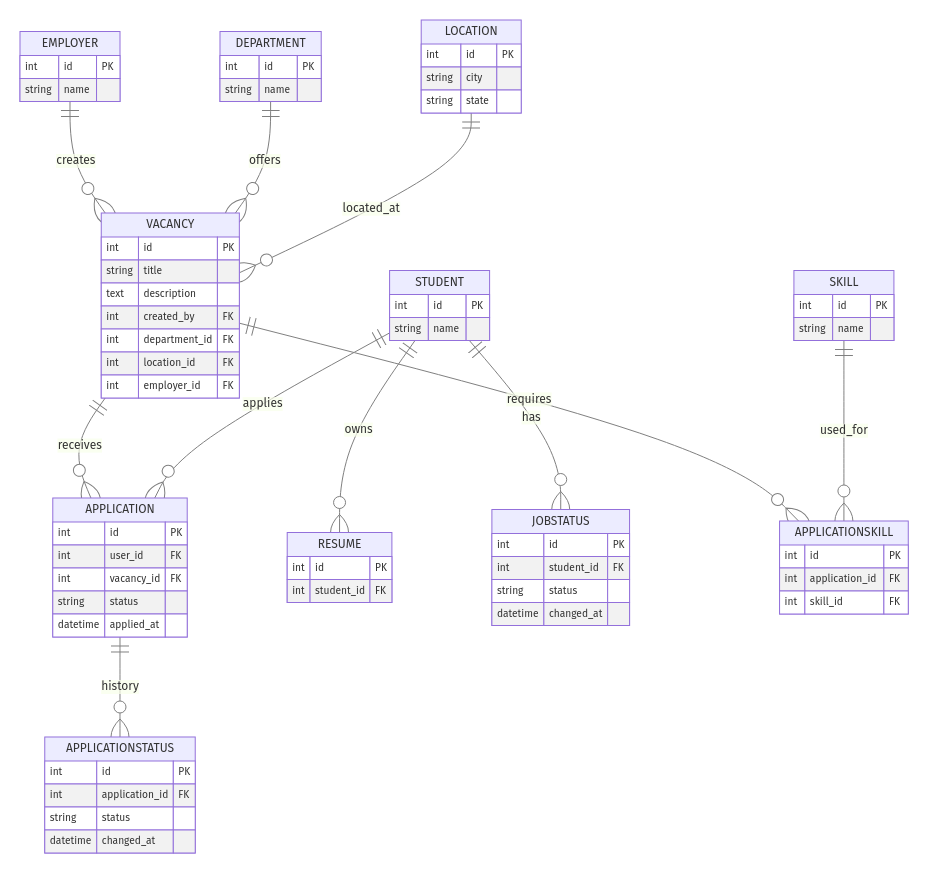

## 📊 ER‑Диаграмма сущностей базы данных

### Сущности

1. **Employer**  
   ‒ `id` PK  
   ‒ `name` string  

2. **Department**  
   ‒ `id` PK  
   ‒ `name` string  

3. **Location**  
   ‒ `id` PK  
   ‒ `city` string  
   ‒ `state` string  

4. **Vacancy**  
   ‒ `id` PK  
   ‒ `title` string  
   ‒ `description` text  
   ‒ `created_by` FK → Student  
   ‒ `department_id` FK → Department  
   ‒ `location_id` FK → Location  
   ‒ `employer_id` FK → Employer  

5. **Student**  
   ‒ `id` PK  
   ‒ `name` string  

6. **Resume**  
   ‒ `id` PK  
   ‒ `student_id` FK → Student  

7. **Application**  
   ‒ `id` PK  
   ‒ `user_id` FK → Student  
   ‒ `vacancy_id` FK → Vacancy  
   ‒ `status` string  
   ‒ `applied_at` datetime  

8. **JobStatus**  
   ‒ `id` PK  
   ‒ `student_id` FK → Student  
   ‒ `status` string  
   ‒ `changed_at` datetime  

9. **ApplicationStatus**  
   ‒ `id` PK  
   ‒ `application_id` FK → Application  
   ‒ `status` string  
   ‒ `changed_at` datetime  

10. **Skill**  
    ‒ `id` PK  
    ‒ `name` string  

11. **ApplicationSkill**  
    ‒ `id` PK  
    ‒ `application_id` FK → Application  
    ‒ `skill_id` FK → Skill  

-----------------------------------

### Связи между сущностями

- **Employer → Vacancy**: Один работодатель создаёт множество вакансий  
- **Department → Vacancy**: Один отдел предлагает множество вакансий  
- **Location → Vacancy**: Одна локация содержит множество вакансий  
- **Student → Resume**: Один студент имеет одно резюме  
- **Student → Application**: Один студент подаёт множество заявок  
- **Vacancy → Application**: Одна вакансия получает множество заявок  
- **Application → ApplicationStatus**: Одна заявка имеет историю изменений статуса  
- **Student → JobStatus**: Один студент может иметь множество записей о статусе  
- **Application ↔ Skill** через **ApplicationSkill**:  
  - Одна заявка может требовать множество навыков  
  - Один навык может быть нужен в множестве заявок  